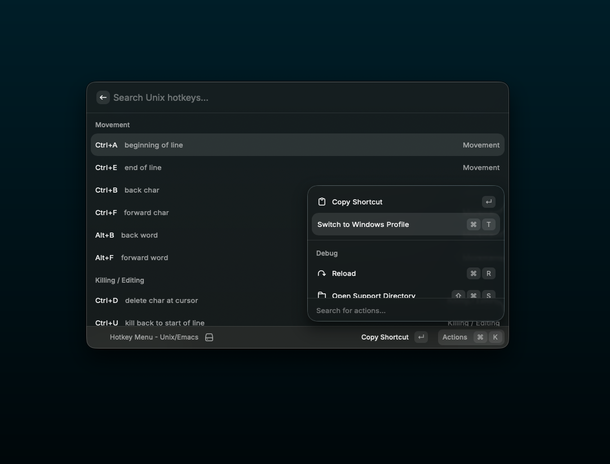

# HarnessKeys

Baseline hotkey reference for Harness-compliant environments.

## Overview

HarnessKeys provides a standardized reference for the hotkeys typically built into modern Harness experiences. These shortcuts represent the baseline interactive model for Harness-compliant inputs and composers, regardless of the underlying provider.

## Features

- Quick Search: Filter the baseline hotkeys already present in your Harness environment.

## Baseline Profiles

### Unix / Readline (Emacs Mode)
Standard shell movement and editing commands expected in Unix-like environments:
- Movement: Start/End of line, Word movement.
- Killing / Editing: Kill to start/end of line, Kill word, Undo, Case manipulation.
- System: Reverse Search, Abort, Redraw screen.

### Windows / PSReadLine (Windows Mode)
Targeted baseline for PowerShell and Windows-native editing:
- Selection: Shift-based character, word, and line selection.
- Editing: Standard Windows Cut/Copy/Paste, Undo/Redo, Delete to start/end of input.
- System: Reverse history search, Tab completion.

## Installation

### For Users (Import Build)
1. Download the latest distribution package.
2. Open Raycast.
3. Search for "Import Extension" and press Enter.
4. Select the unzipped distribution folder.

### For Developers (Source)
1. Clone the repository: `git clone git@github.com:jhavenz/hotkey-menu.git`
2. Install dependencies: `bun install`
3. Start development mode: `npm run dev`
4. Register the extension in Raycast Settings > Extensions.

---
Created by havytech.
